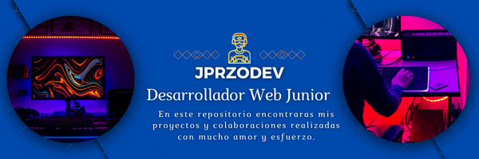

# Welcome to my GitHub, thank you for being here💖! | Bienvenid@ a mi GitHub gracias por estar aqui💖!

) 

## About me | Un poco sobre mi 😴

<h4 align="center"><samp>I began my professional journey as a public accountant, delving into numbers and balances with precision. However, the world of web development sparked my curiosity and creativity in unexpected ways. I immersed myself in the realm of code, uncovering a universe of possibilities to create and address societal needs. Today, I merge my accounting experience with my passion for programming, continuously seeking new ways to innovate and enhance our digital landscape. The opportunity to create and transform never fails to excite me!</samp></h4>

<h4 align="center"><samp>Comencé mi trayectoria profesional como contador público, explorando números y balances con precisión. Sin embargo, el mundo del desarrollo web despertó mi curiosidad y creatividad de una manera que no esperaba. Me sumergí en el mundo del código, descubriendo un universo de posibilidades para crear y solucionar necesidades en nuestra sociedad. Hoy, fusiono mi experiencia en contabilidad con mi pasión por la programación, buscando constantemente nuevas formas de innovar y mejorar nuestro entorno digital. ¡La oportunidad de crear y transformar nunca deja de emocionarme!  </samp></h4> 

## Technologies I've worked with | Tecnologias que he utilizado👨‍💻

 

## Stats | Estadisticas 
 

## Objectives | Objetivos
<h4 align="start"><samp>I'm relatively new to the tech industry, but I'm motivated and eager to bring solutions and create new tools to make life more awesome. 😎🤩</samp></h4>

<h4 align="start"><samp>Llevo poco tiempo en este gremio tech pero estoy motivado y quiero traer soluciones y crear nuevas herramientas para hacer la vida mas chida 😎🤩</samp></h4>
<iframe src="https://giphy.com/embed/SHjOSDkKZ18qOHA5B5" width="250" height="150" frameBorder="0" class="giphy-embed" allowFullScreen></iframe><iframe src="https://giphy.com/embed/yeE6B8nEKcTMWWvBzD" width="250" height="150" frameBorder="0" class="giphy-embed" allowFullScreen></iframe>
